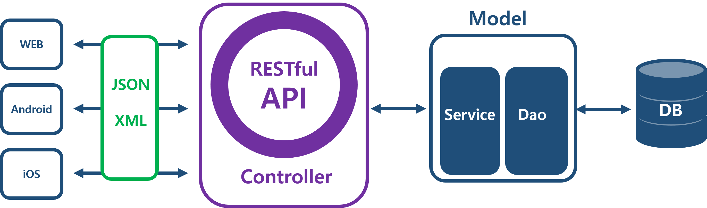
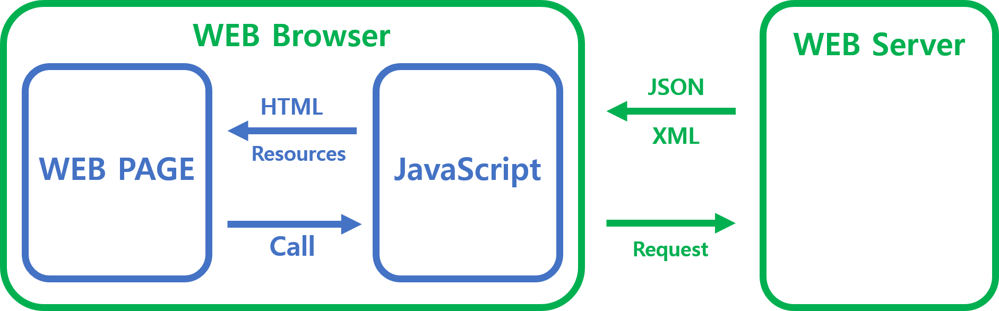
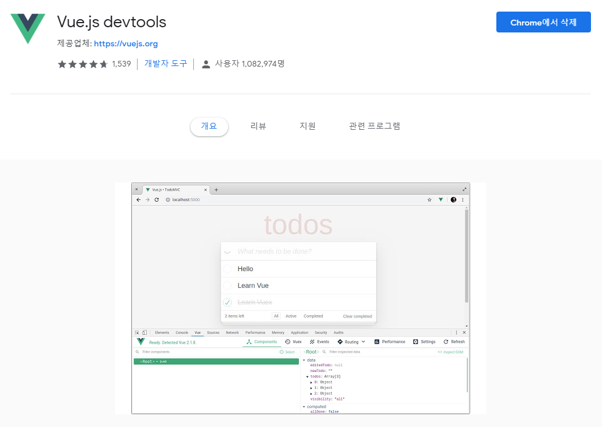
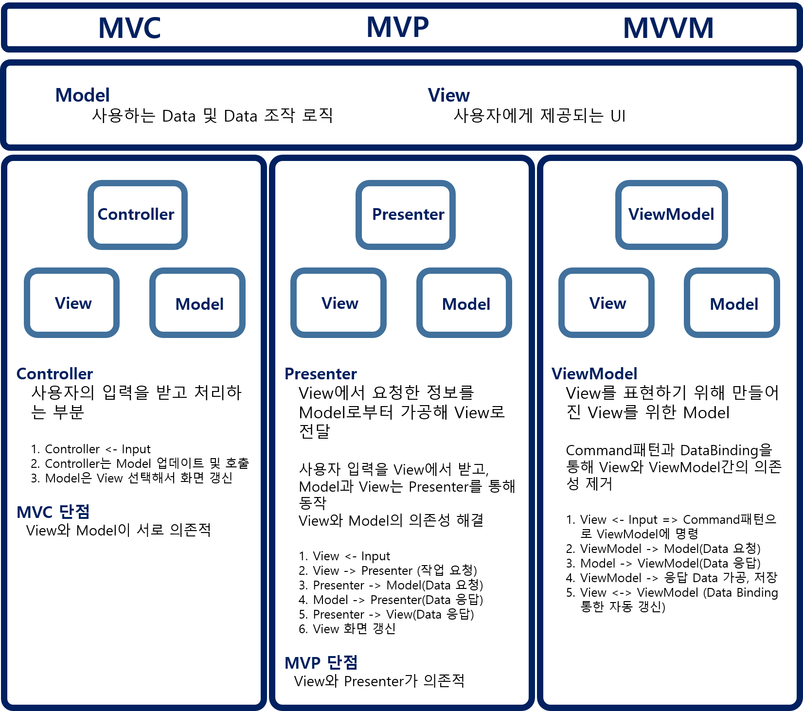

# **Vue.js**

## **목차**

1. [개요](#개요)
2. [Vue 시작](#Vue-시작)
3. [Vue의 데이터 화면 표기 방법](#Vue의-데이터-화면-표기-방법)
4. [Vue 인스턴스](#Vue-인스턴스)
5. [Vue 객체 LifeCycle](#Vue-객체-LifeCycle)
6. [Vue Directive](#Vue-Directive)

---

## **개요**

### **0. 정의**

> 웹 개발을 단순화하고 정리하기 위해 개발된 대중적인 자바스크립트 프론트엔드 프레임워크

### **1. REST Controller를 활용한 MVC 패턴**

다음과 같은 MVC 웹 아키텍쳐에서



각각 UI에 맞는 서버 구성의 불편함을 제거하기 위해 서비스 대상을 JSON, XML과 같은 자원으로 표현하는 RESTful 서비스를 제공할 수 있다

### **2. Ajax 활용**

- Ajax를 활용하여 비동기 통신을 통해 RESTful 서비스로 데이터를 받고, 화면 변경 처리 등을 수행

=> Ajax를 활용하여 한 페이지에서 동적으로 화면변경

Ajax Web Model



### **3. SPA(Single Page Application)**

> 서버로부터 완전히 새로운 페이지를 불러오지 않고 현재의 페이지 일부를 동적으로 작성함으로써 사용자와 소통하는 웹 애플리케이션

- 페이지 하나에서 동적으로 필요한 화면만 교체함으로 중복된 리소스 요청을 줄임
- 향상된 사용자 경험(UX)을 제공

### **4. Vue의 등장**

- SPA를 개발하더라도 css, jquery 등 고유한 화면을 만들기 위해 다양한 것들이 사용되었고 플러그인들간의 충돌 때문에 문제가 생기기도 했었음

=> 화면을 컴포넌트화 하여 컴포넌트를 교체해주는 방식을 고안

jQuery등이 작업했던 화면 데이터나 동적 처리 기능(함수) 등을 컴포넌트화하여 제공

---

### **JavaScript와 Java**

- JAVASCRIPT  
  웹에서 http을 클라이언트단에서 동적으로 만들어주는 웹전용 스크립트언어  
  Java의 인기 때문에 이름을 붙였으나 ECMS라고 이름이 바뀜(ES)  
  2015년도부터 ES6문법이 생겼으나, ES6가 지원되지않는 브라우저에서는 적용되지 않음(Cross Browsing 필요)  
  Vue에서는 편하게 바벨이 모든 브라우저에 통용되게 ES5로 바꿔줌

- JAVA  
  플랫폼을 제공해주는 언어

---

## **Vue 시작**

크롬 웹스토어에서 Vue.js devtools 추가



- CDN으로 라이브러리를 자동으로 포함

- Vue 객체를 생성
  1. el  
     element의 약자로 표시할 화면으로, 대체적으로 id이용
  2. data  
     화면에 뿌려줄 데이터

```html
<!DOCTYPE html>
<html lang="en">
  <head>
    <meta charset="UTF-8" />
    <meta name="viewport" content="width=device-width, initial-scale=1.0" />
    <meta http-equiv="X-UA-Compatible" content="ie=edge" />
    <title>Document</title>
    <script src="http://unpkg.com/vue"></script>
  </head>

  <body>
    <div id="app">
      <span> {{title}} </span>
    </div>
    <script>
      var model = { title: "제목" };
      var app = new Vue({
        el: "#app",
        data: model
      });
    </script>
  </body>
</html>
```

- 모델은 data, 화면이 view로 Vue 객체는 화면과 모델을 가지고 있는 MVC의 확장 MVVM 모델로 VM(View Model)를 vue가 담당함

---

### **MVC vs MVP vs MVVM 패턴 비교**



---

## **Vue의 데이터 화면 표기 방법**

Tag Body에 출력하는 방법과 Binding하는 방법 합쳐 총 5가지 방식으로 데이터를 화면에 표기할 수 있음

### 1. 보간법(1)

- tag body에 사용
- title 속성을 보간법으로 출력함
- vue 객체가 화면을 동적으로 관리

```html
<tag명 id="app">
  <tag명>{{title(속성명)}}</tag명>

  new Vue({ el:"#app" data:{title:'제목'} });</tag명
>
```

### 2. 보간법(2) v-text

- innerTEXT와 같은 효과
- text로 인식

### 3. 보간법(3) v-html

- innerHTML과 같은 효과
- html로 인식

### 보간법을 활용한 데이터 표기

```html
<div id="app">
  1. <span>{{title}}</span><br />
  2. <span v-text="title"></span><br />
  3. <span v-html="title"></span><br />
</div>
<script>
  var model = { title: "<h1>제목</h1>" };
  var app = new Vue({
    el: "#app",
    data: model
  });
</script>
```

## **this 용법**

- this 용법 정리 참고 사이트 :
  [w3School](https://www.w3schools.com/js/js_this.asp)

- 기본 값 : 특별히 설정된 객체가 없다면 Global Object(Window)

- 등록된 Event : 이벤트 발생 시 해당 HTML Element(발생 객체)

- Object Method Binding : 해당 Object

---

## **Vue 인스턴스**

vue 인스턴스 옵션이 존재

- el
- template
- data
  - Object : 정적인 데이터
  - Function : 동적인 데이터 표시
- props(property)
  - 컴퍼넌트끼리 데이터를 주고 받는 통로

---

### **props** vs **eventBus**

- 뷰를 컴퍼넌트화 시켰기 때문에 서로 통신할 수 있는 방법이 필요
- 부모 자식간의 통신, 형제간의 통신..
- Event Bus로도 부모 자식간의 통신이 되지만 상태관리 측면을 위해 VueX 사용

---

### **함수 정의**

| `filters`                                                   | `methods`                          | `computed`                                                                                                                     | `watch`                                   |
| :---------------------------------------------------------- | :--------------------------------- | :----------------------------------------------------------------------------------------------------------------------------- | :---------------------------------------- |
| Data 필터링 할 때 사용하며, 데이터가 인자로 자동으로 들어감 | 호출 할 때 마다 정의된 메소드 수행 | 처음에 자동 수행, 종속 대상을 따라 저장(캐싱)되어 정적인 내용을 위해 사용. 해당 속성이 종속된 대상이 변경될 때만 함수를 실행함 | 데이터 변경을 관찰하고 이에 반응하는 속성 |

- methods는 라이프사이클과 상관없어서 이벤트 발생시 호출이 직접 필요함. 이 때마다 수행되는 것

- filters , computed는 직접호출하지만 라이프사이클과 연결되서 자동으로 호출

- filters는 속성에 따라 속성변화시 필터처리를 해준다.
- filters는 데이터 변경 시마다 자동으로 호출

```html
<div id="app">
  <div>{{title|toH3}}</div>
</div>
<script>
  //body에 script하는 이유는 element가 head, body 순으로 수행되기때문에 binding을 위해 뒤에 작성하는 것
  var app = new Vue({
    el: "#app",
    data: { title: "Title" },
    filters: {
      toH3: function(value) {
        //filter 함수에 전달되는 인자는 해당 데이터
        return value + "HELLO";
      }
    }
  });
</script>
```

## **Vue 객체 LifeCycle**

new Vue()

1. **beforeCreate**  
   데이터 관찰, 이벤트 / 감시자 설정 전에 인스턴스가 초기화 된 후에 동기적으로 호출
   Vue 객체 생성 전에 데이터, 함수, 필터 등이 접근이 안되는 상태

2. **created**  
   인스턴스가 생성된 후에 동기적으로 호출됨.  
   이 단계에서 인스턴스가 데이터 관찰, 계산 된 속성, 메서드, 감시 / 이벤트 콜백이 설정완료된 상태.  
   하지만 아직 \$el 속성을 사용할 수 없음.  
   Vue 객체가 생성된 상태, 이때부터 접근 가능

3. **beforeMount**  
   mount 되기 전 상태이고 render 함수가 처음으로 호출됨.

4. **mounted**  
   html의 DOM 트리가 화면에 렌더링 된 상태가 mounted 되는 것이므로, mounted 이전에는 화면이 없어 렌더링이 불가하므로 DOM트리가 구성이 되고 화면에 표시되는 상태
   (이때 서버로부터 데이터를 받아 뿌려주는 작업을 수행해야함)

5. **beforeUpdate**  
   DOM이 패치되기 전에 데이터가 변경 될 때 호출됨. 업데이트 전에 기존 DOM에 접근하는 것이 좋음(ex) 수동으로 추가된 이벤트 리스너 제거 등)

6. **updated**  
   데이터 변경 후 호출하면 가상 DOM이 다시 렌더링되고 패치됨.  
   상태 변경에 반응하려면 일반적으로 computed 이나 watcher를 사용하는 것이 좋음.  
   데이터가 변경된 후
   화면갱신마다 beforeUpdate, updated가 일어남

7. **beforeDestroy**  
   Vue 객체 삭제 전에 호출
   인스턴스는 아직까지 작동

8. **destroyed**  
   Vue 객체 삭제된 후에 호출  
   VUe 인스턴스의 모든 지시문이 바인드 해제되고, 모든 이벤트리스너 제거 및 모든 하위 Vue 인스턴스 역시 삭제됨

### **LifeCycle**

;

```html
<!DOCTYPE html>
<html lang="en">
  <head>
    <meta charset="UTF-8" />
    <meta name="viewport" content="width=device-width, initial-scale=1.0" />
    <meta http-equiv="X-UA-Compatible" content="ie=edge" />
    <title>Document</title>
    <script src="http://unpkg.com/vue"></script>
  </head>
  <body>
    <div id="lifeCycle">
      <div v-on:click="showName">클릭</div>
      <div v-on:click="removeVue">Vue객체 삭제</div>
    </div>
    <script>
      var app = new Vue({
        el: "#lifeCycle",
        data: { title: "제목" },
        methods: {
          // 호출시 마다 매번 수행
          // vue 객체 삭제
          removeVue: function() {
            app.$destroy();
          },
          showName: function() {
            console.log("showName..........");
            return (this.$data.title = "제목");
          }
        },
        computed: {
          // cache에 들어가는 정적 데이타 초기화 관리
          compu: function() {
            // watched 이용해 변경된 내용 반영 가능
            console.log("showName.........."); // 라이프 사이클과 관련
            return (this.$data.title = "제목");
          }
        },
        // Vue 객체가 생성되기 전에 호출되는 hook
        beforeCreate: function() {
          console.log("beforeCreate " + this.title);
        },
        // Vue 객체가 생성된 후에 호출되는 hook
        created: function() {
          console.log("created " + this.title);
        },
        // DOM 트리가 구성이 되고 렌더링되기 전에 호출
        beforeMount: function() {
          console.log("beforeMount " + this.title);
        },
        // DOM 트리가 구성이 되고 렌더링된 후에 호출
        mounted: function() {
          console.log("mounted " + this.title);
        },
        // Vue 모델(data)가 변경되기 전에 호출
        beforeUpdate: function() {
          console.log("beforeUpdate " + this.title);
        },
        // Vue 모델(data)가 변경된 후에 호출
        updated: function() {
          console.log("updated " + this.title);
        },
        // Vue 객체가 삭제되기 전에 호출
        beforeDestroy: function() {
          console.log("beforeDestroy ");
        },
        // Vue 객체가 삭제된 후에 호출
        destroyed: function() {
          console.log("destroyed ");
        }
      });
    </script>
  </body>
</html>
```

## **Vue Directive**

### 1. 바인딩 방식

### v-bind

```html
<tag v-bind : 속성명=속성값(Vue의 Data가 Binding)>
<input name="name" value=" " />
<input name="name" v-bind:value=" " />
```

- 단방향  
  모델에 있는 값을 바인딩하는 것 밖에 못함  
  input양식으로 고쳐서 한다고 뷰의 모델 값 수정 불가  
  변경된 내용이 뷰에 전달 되지 않는다는 것

### v-model

```html
<input name="name" v-model="message" />
```

- 양방향
  변경된 내용이 Vue 모델 값에도 적용되도록하려면 v-model 사용

### 2. 조건부 렌더링

### v-if / v-else

```html
<div id="app">
  <div v-text="title"></div>
  <!-- 조건이 false면 body 내용이 주석 처리. -->
  <div v-if="hasResult"><h2>if {{title}}</h2></div>
  <div v-else><h2>else {{id}}</h2></div>
  <!-- 조건 = false => body 내용이 display: none-->
  <div v-show="hasResult"><h2>show {{title}}</h2></div>
</div>

<script type="text/javascript">
  var model = { title: "Title", id:'Vue };
  var first = new Vue({
    el: "#app",
    data: model,
    computed: {
      hasResult: function() {
        return this.title.length > 10;
      }
    }
  });
</script>
```

| `v-if`                                                               | `v-show`                                                    |
| -------------------------------------------------------------------- | ----------------------------------------------------------- |
| 조건부 블록 안의 이벤트 리스너와 자식 컴포넌트 토글 동안 적절히 제거 | CSS 기반 토글만으로 초기 조건 관계없이 엘리먼트 항상 렌더링 |
| 토글비용이 높음                                                      | 초기 렌더링비용이 높음                                      |
| 런타임 시 조건 변경 없으면 v-if                                      | 자주 바뀐다면 v-show                                        |

### template

- v-if는 디렉티브이므로 하나의 엘리먼트가 추가필요
- 하나 이상의 엘리먼트를 트랜지션하려면 보이지 않는 wrapper 역할의 `<template>` 이용

```javascript
<template v-if="ok">
  <h1>Title</h1>
  <p>Paragraph 1</p>
  <p>Paragraph 2</p>
</template>
```

### 3. 리스트 렌더링

### v-for

- v-for 디렉티브를 사용해 배열 기반으로 리스트 렌더링 가능

- item in items 형태 문법 필요.
  - items : 원본 데이터 배열
  - item : 반복되는 배열 엘리먼트

### 4. 이벤트 핸들링

### **'v-on' Directive**

#### Listening to Events

- v-on 디렉티브를 사용해 이벤트 발생 시 JavaScript 실행되도록 함

```javascript
<div id="v_onExam">
  <button v-on:click="cnt">Btn</button>
  <p>버튼 클릭 횟수: {{ cnt }}번</p>
</div>;

var example1 = new Vue({
  el: "#v_onExam",
  data: {
    cnt: 0
  }
});
```

#### 메소드 이벤트 핸들러

- 로직이 항상 단순하지 않기 때문에 v-on은 호출하고자 하는 메소드를 받아 이벤트 발생시 수행할 수 있음

```javascript
<div id="v_onExam2">
  <button v-on:click="calledMethod">HELLO</button>
</div>;

var example2 = new Vue({
  el: "#v_onExam2",
  data: {
    name: "Vue.js"
  },
  // 메소드는 `methods` 객체 안에 정의
  methods: {
    calledMethod: function(event) {
      // 메소드 안에서 사용하는 `this` = Vue 인스턴스
      console.log("Method Event Handler " + this.name);
    }
  }
});
```

#### 인라인 메소드 핸들러

- 메소드 이름을 직접 바인딩 하지 않고 인라인으로 메소드 사용 가능

```javascript
<div id="v_onExam3">
  <button v-on:click="callMethod('hello world')">HELLO WORLD</button>
</div>;

new Vue({
  el: "#v_onExam3",
  methods: {
    callMethod: function(message) {
      alert(message);
    }
  }
});
```

#### 이벤트 수식어

- Event Hanlder 내부에서 event.stopPropagation()와 같은 메소드를 호출할 수 있으나, DOM 이벤트 세부 사항 처리보다 데이터 로직에 대한 메소드만 사용하도록 이벤트 수식어를 제공함

- 이벤트 수식어 키워드 일부
  > .stop  
  > .prevent  
  > .once

```html
<!-- 클릭 이벤트 전파가 중단 -->
<a v-on:click.stop="doEvent"></a>

<!-- 제출 이벤트가 페이지를 다시 로드 하지 않음. form의 오작동 방지 -->
<form v-on:submit.prevent="onSubmit"></form>

<!-- 클릭 이벤트는 최대 한번만 트리거됨 .once 수식어는 컴포넌트 이벤트에서도 사용 가능-->
<a v-on:click.once="doEvent"></a>
```

##

남은 파트  
14  
AXIOS
폼데이터 처리  
15  
npm부터 몇가지 가벼운 설명들  
18  
전체 설명 간단히
이벤트 버스
부모 자식 컴퍼넌트  
19  
vuex 상태관리
vue router
전체 정리
